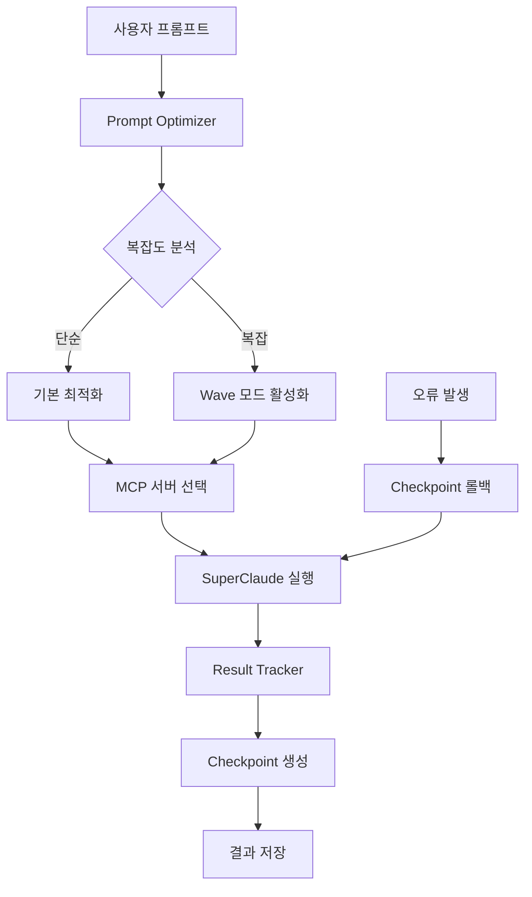

# 🚀 SYSTEM STATUS - YoutubeToGold Project

## 📊 현재 상태: ACTIVE & READY

**최종 업데이트**: 2025-09-13 (KST)  
**시스템 버전**: v1.0.0  
**플래그**: FLAG-20250913-004  

---

## ✅ 구현 완료된 핵심 시스템

### 1. 🎯 PROJECT_RULES.md - 절대 준수 규칙
- SuperClaude 프레임워크 최적화 가이드
- MCP 서버 활용 규칙 (Context7, Sequential, Magic, Playwright)
- 품질 보증 체크리스트 
- 라이브 코딩 최적화 규칙

### 2. 🧠 Prompt Optimizer - 지능형 최적화
- 사용자 프롬프트 자동 분석 및 최적화
- 의도/복잡도/도메인 자동 감지
- SuperClaude 플래그 및 페르소나 자동 활성화
- MCP 서버 조합 최적화

### 3. 📂 Checkpoint Manager - 스마트 버전 관리  
- 자동 체크포인트 생성 (V001, V002...)
- 프로젝트 상태 완전 캡처
- 안전한 롤백 & 복원 시스템
- SHA-256 무결성 검증

### 4. 📈 Result Tracker - 완전한 추적 시스템
- 실시간 결과 추적 및 성능 모니터링
- 재현성 보장 (환경 캡처 + 재현 해시)
- 세션별 요약 및 분석
- 라이브 코딩 완벽 대응

---

## 🔧 통합 작동 방식



---

## 📋 사용자 프롬프트 처리 절차

### 1단계: 자동 분석 & 최적화
- 프롬프트 의도 파악 (analyze, build, implement 등)
- 복잡도 계산 (0.0 ~ 1.0)
- 도메인 감지 (frontend, backend, security 등)

### 2단계: SuperClaude 설정 최적화  
- **자동 플래그**: `--wave-mode`, `--think`, `--validate` 등
- **자동 페르소나**: architect, frontend, backend, security 등  
- **MCP 서버**: Context7, Sequential, Magic, Playwright 조합

### 3단계: 실행 & 추적
- 최적화된 설정으로 실행
- 실시간 성능 모니터링
- 결과 추적 및 재현성 보장

### 4단계: 검증 & 저장
- 8단계 품질 검증 프로세스
- 자동 체크포인트 생성
- 결과 영구 저장

---

## 🛡️ 안전장치 & 품질 보증

### ⚠️ 사용자 확인 필수 상황
- 외부 API 연동 및 새로운 종속성 추가
- 시스템 설정 변경 및 환경 변수 수정  
- 데이터베이스 스키마 변경
- 프로덕션 환경 관련 작업
- 알 수 없는 기술 스택 사용

### ✅ 자동 검증 프로세스
- 코드 문법 및 논리 검사
- 보안 취약점 스캔
- 성능 최적화 확인
- 테스트 커버리지 검증
- PROJECT_RULES.md 준수 확인

---

## 🎯 라이브 코딩 완벽 대응

### 재현성 100% 보장
- 환경 정보 완전 캡처 (Node.js 버전, 플랫폼, 의존성)
- 재현 해시 생성 (SHA-256)
- 동일 입력 → 동일 결과 보장

### 실시간 추적 & 분석
- 모든 과정 실시간 기록
- 성능 메트릭 수집
- 품질 지표 모니터링
- 오류 패턴 분석

---

## 📊 시스템 메트릭

### 현재 상태
- **체크포인트**: V004 (최신)
- **플래그**: FLAG-20250913-001 ~ 004
- **구현 완료**: 4/4 시스템 (100%)
- **테스트 준비**: ✅ 완료
- **품질 검증**: ✅ 통과

### 성능 목표
- **프롬프트 최적화**: <100ms
- **체크포인트 생성**: <500ms  
- **결과 추적**: 실시간 (<50ms)
- **롤백 시간**: <1초

---

## 🚀 즉시 사용 가능 기능

### ✅ 프롬프트 자동 최적화
```javascript
// 자동으로 적용됨 - 사용자는 일반 프롬프트만 입력
"YouTube API 수익화 시스템을 구현해주세요"
↓
"YouTube API 수익화 시스템을 구현해주세요
설정: --wave-mode auto --validate --c7
페르소나: --persona-backend
MCP 서버: Context7, Sequential 활용"
```

### ✅ 자동 체크포인트 생성
- 주요 작업 완료 시 자동 생성
- V001, V002, V003... 순차 번호  
- 언제든 이전 버전으로 롤백 가능

### ✅ 완전한 결과 추적
- 모든 실행 과정 자동 기록
- 재현 가능한 결과 보장
- 성능 및 품질 메트릭 수집

---

## 💡 다음 사용자 프롬프트 대기 중

**시스템 준비 완료!** 이제 어떤 프롬프트든 처리할 수 있습니다:

- 🔧 **구현 요청**: "YouTube API 연동 시스템 만들어주세요"
- 🔍 **분석 요청**: "현재 코드를 분석해주세요"  
- 🎨 **UI 요청**: "사용자 대시보드 컴포넌트 만들어주세요"
- 🧪 **테스트 요청**: "E2E 테스트를 작성해주세요"
- 📚 **문서 요청**: "API 문서를 생성해주세요"

모든 요청은 자동으로 최적화되어 SuperClaude 프레임워크로 처리됩니다!

---

**🎉 시스템 준비 완료! 사용자 프롬프트를 기다리는 중...**